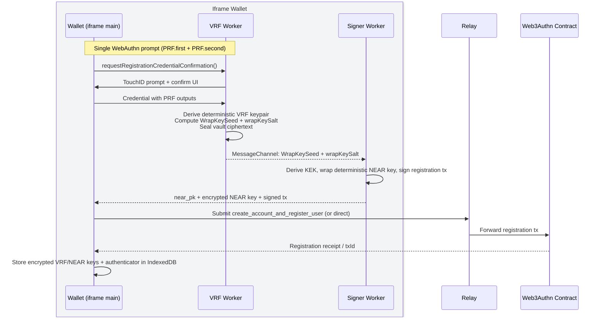
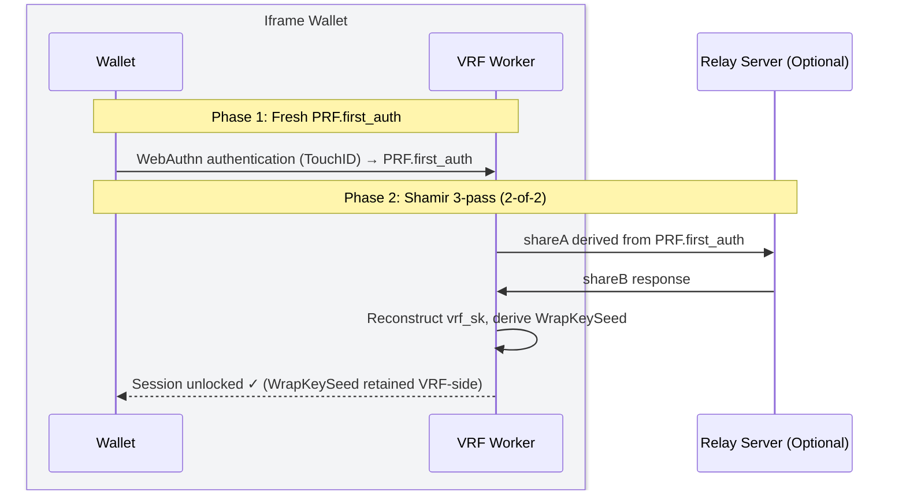
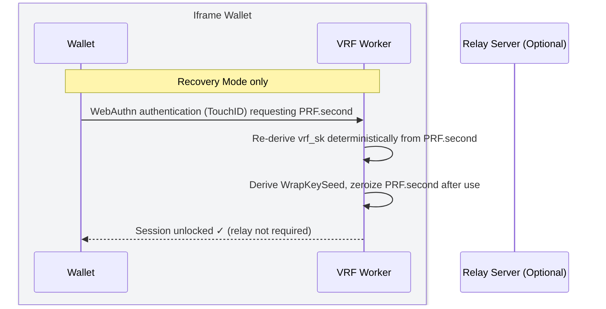
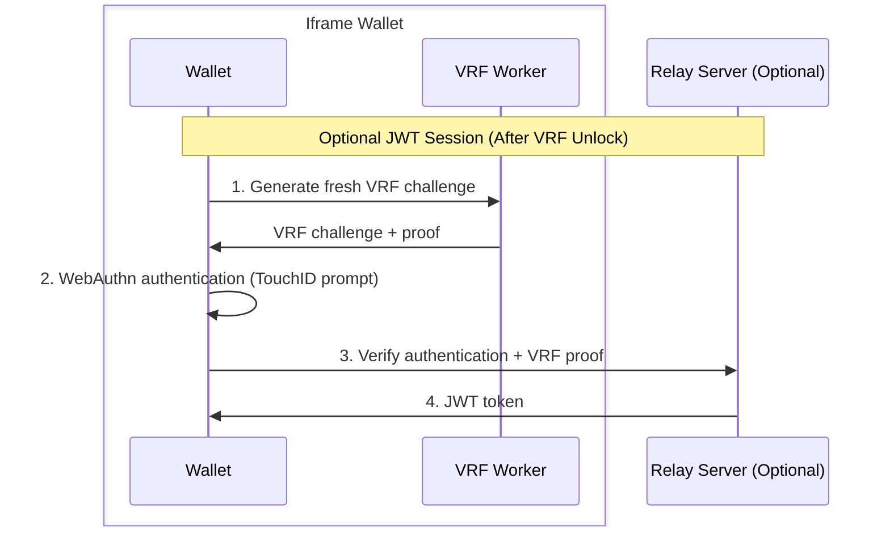
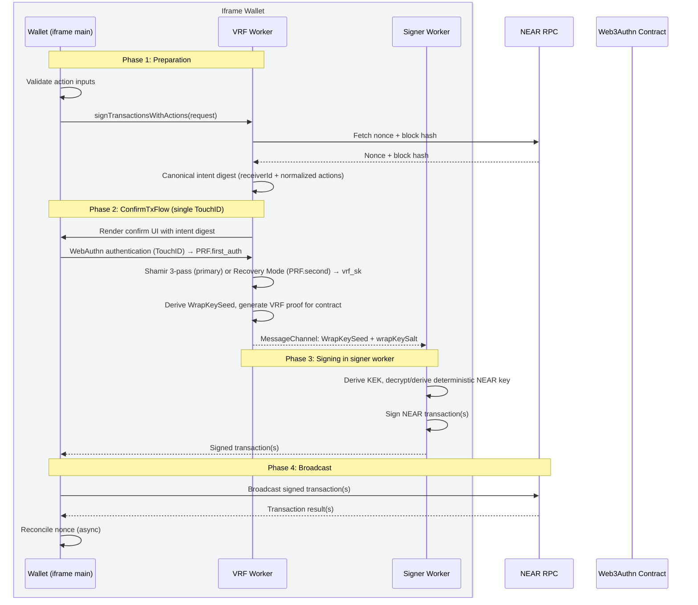

# Architecture

- [Overview](#overview)
- [Transaction Lifecycle](#transaction-lifecycle)
  - [Registration Flow](#registration-flow)
  - [Login Flow](#login-flow)
  - [Transaction Flow](#transaction-flow)
- [VRF WebAuthn](./vrf-webauthn)
- [Passkey Scope](./passkey-scope)

## Overview

The wallet runs in an isolated iframe context, separate from application code. Think of it as a mini web app in an iframe that your app "dials into" for secure operations.

The wallet mounts a hidden iframe at its own origin. Inside that iframe, two WASM workers hold secrets:

- **VRF worker** – owns WebAuthn/PRF handling, Shamir 3-pass with the relay, derives `WrapKeySeed`, enforces canonical digests.
- **Signer worker** – receives only `WrapKeySeed + wrapKeySalt` over an internal `MessageChannel`, derives the KEK, unwraps `near_sk`, and signs.

Normal sessions are **2-of-2** (device + relay via Shamir 3-pass) and always require fresh WebAuthn for `PRF.first`. A high-friction **PRF.second recovery** path exists only for registration, device linking, or explicit recovery.

The transaction signing flow follows this lifecycle:
1. **Mount**: SDK creates hidden iframe pointing at wallet origin.
2. **Request**: App calls methods like `registerPasskey()` or `signTransactionsWithActions()` by sending typed messages.
3. **User Confirmation**: Wallet routes requests to workers, triggers a TouchID/WebAuthn prompt, and shows intent UI from the wallet origin.
4. **Execute**: VRF-WebAuthn completes, VRF worker runs Shamir 3-pass (or explicit recovery), derives `WrapKeySeed`, and signer worker signs.
5. **Response**: Wallet streams progress events back to your app, then returns signed transaction payloads.

# Transaction Lifecycle

This section outlines the core stages of the transaction lifecycle for:
1. registration flows,
2. login flows, and
3. transaction signing flows (WebAuthn authentication).

Each section illustrates how the wallet handles VRF operations, onchain verification, transaction signing, and dispatch.

## Registration Flow

Registration creates the passkey, derives deterministic keys, and seals them with the dual-worker pipeline from a single TouchID prompt. PRF outputs stay VRF-side; the signer only receives `WrapKeySeed + wrapKeySalt` over the internal channel.

::: tip **Steps:**
1. **WebAuthn registration** – VRF worker collects the credential (PRF.first + PRF.second) from the wallet-origin UI.
2. **Derive deterministic keys** – VRF worker derives deterministic VRF/NEAR keys, `WrapKeySeed`, and `wrapKeySalt`; only the seed + salt cross to the signer via `MessageChannel`.
3. **Sign and register** – Signer worker seals the deterministic NEAR key with the KEK and signs the registration tx.
4. **Store vault** – Encrypted deterministic keys, salts, and authenticator metadata live in the wallet’s IndexedDB; plaintext never leaves workers.
:::

**Key cryptographic properties:**
- **Origin-bound PRF** – WebAuthn PRF binds all derived keys to the wallet origin.
- **Challenge binding** – Bootstrap VRF ties fresh NEAR block data to the WebAuthn challenge for replay resistance.
- **Atomic verification** – Contract verifies VRF proof + WebAuthn registration together.
- **Isolation** – Only `WrapKeySeed + wrapKeySalt` cross the worker boundary; PRF outputs and `vrf_sk` stay VRF-side.

## Login Flow

Session unlock reconstructs `vrf_sk` and derives a fresh `WrapKeySeed`. Primary mode is Shamir 3-pass (relay + device), always gated by fresh WebAuthn (`PRF.first_auth`). Backup mode uses `PRF.second` only in explicit Recovery Mode.

### Path A: Primary Shamir 3-Pass (fresh TouchID)

::: tip **Steps**:
1. Trigger WebAuthn PRF for `PRF.first_auth` (TouchID).
2. VRF worker derives shareA and runs Shamir 3-pass with the relay to reconstruct `vrf_sk`.
3. Derive `WrapKeySeed` from `PRF.first_auth || vrf_sk`; keep it inside the VRF worker.
4. Session is ready to derive KEKs for signing. No secrets leave workers; main thread never sees PRF/`vrf_sk`.
:::

### Path B: Explicit PRF.second Recovery

::: tip **Steps**:
1. User opts into Recovery Mode; wallet requests `PRF.second` in addition to `PRF.first`.
2. VRF worker re-derives `vrf_sk` deterministically (no relay needed).
3. Derive `WrapKeySeed` and proceed with signing/unwrapping.
4. PRF.second is zeroized immediately; this path is high-friction and logged.
:::

### Optional: JWT Session Token

After login, you can optionally mint a JWT session token for web2 authentication:

::: info **Security properties:**
- **VRF stays in worker**: Never exposed to main thread
- **Session-scoped**: VRF keypair is reconstructed per session with fresh WebAuthn
- **Primary 2-of-2**: Shamir 3-pass uses relay + device
- **PRF.second backup**: Only in Recovery Mode; zeroized immediately
:::

## Transaction Flow

::: tip **Steps:**
1. **Preparation** – Validate inputs and fetch nonce/block hash; compute canonical intent digest in the VRF worker.
2. **ConfirmTxFlow** – Single TouchID prompt; VRF worker runs Shamir 3-pass (or explicit Recovery Mode), derives `WrapKeySeed`, and produces the VRF proof; only the seed + salt cross to the signer.
3. **Signing** – Signer worker derives/decrypts the deterministic NEAR key with the KEK and signs the transaction(s).
4. **Broadcasting** – Wallet broadcasts signed txs to NEAR RPC, receives results, and reconciles nonce.

**Single biometric prompt** per transaction.
:::

## Next Steps

- [VRF WebAuthn](vrf-webauthn) discusses how the VRF-WebAuthn system works
- Read about the [Security Model](security-model)
- Explore [Passkey Scope Strategy](passkey-scope) for deployment options
- Review [Shamir 3-Pass Protocol](../guides/shamir-3-pass-protocol) for the primary 2-of-2 unlock path
