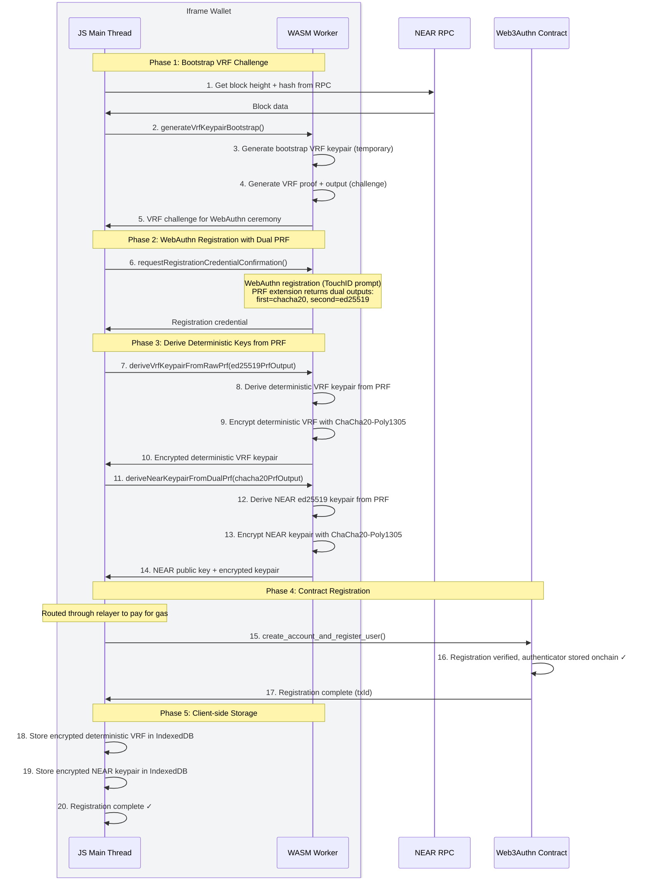
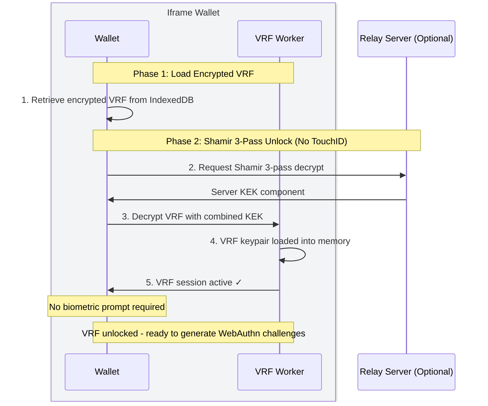
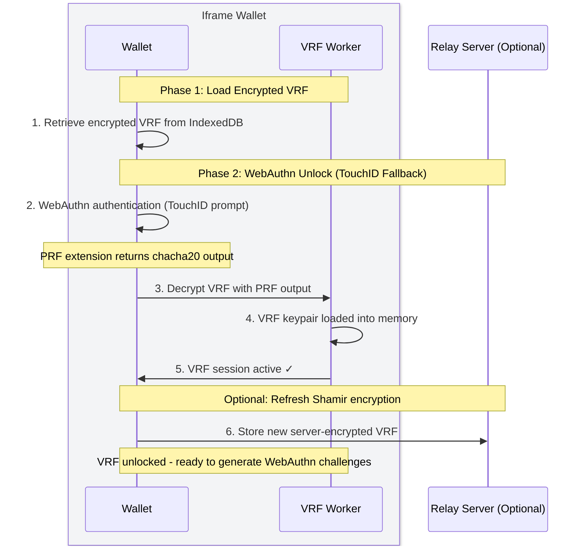
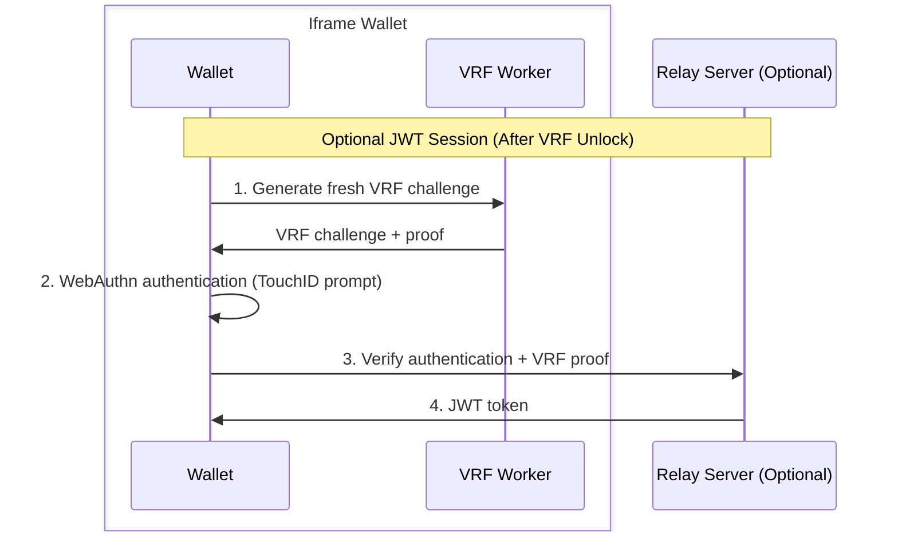
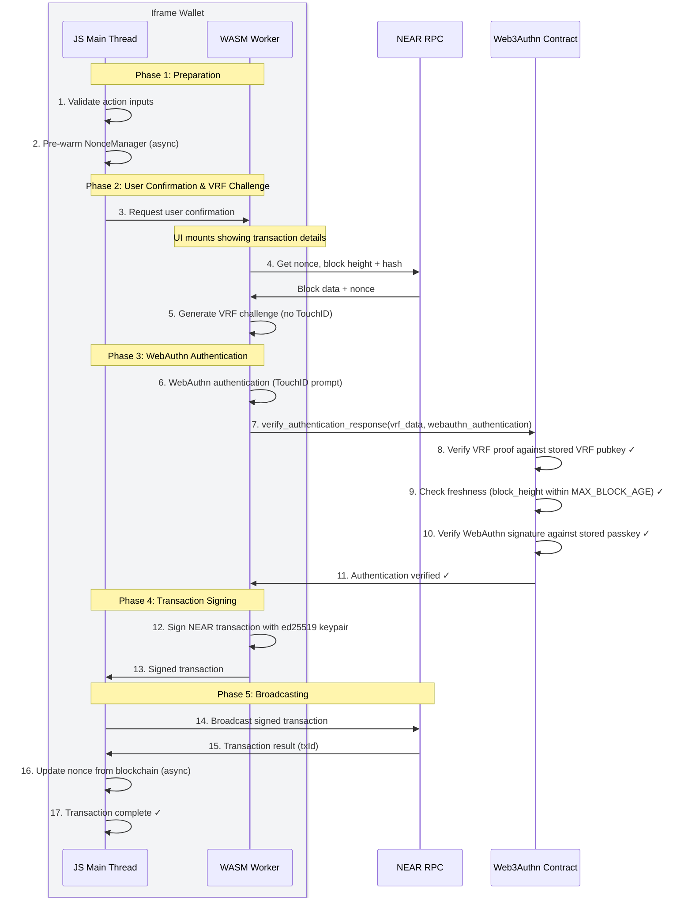

# Architecture

- [Overview](#overview)
- [Transaction Lifecycle](#transaction-lifecycle)
  - [Registration Flow](#registration-flow)
  - [Login Flow](#login-flow)
  - [Transaction Flow](#transaction-flow)
- [VRF Webauthn](./vrf-webauthn)
- [Passkey Scope](./passkey-scope)

## Overview

The wallet runs in an isolated iframe context, separate from application code. Think of it as a mini web app in an iframe that your app "dials into" for secure operations.

The transaction signing flow follows this lifecycle:
1. **Mount**: SDK creates hidden iframe pointing at wallet origin
2. **Request**: App calls methods like `registerPasskey()` or `signTransactionsWithActions()` by sending typed messages.
3. **User Confirmation**: Wallet routes requests to workers, which requests user TouchId confirmation and mounts UI with transaction payload information.
4. **Execute**: VRF Webauthn verification completes (TouchID) and runs transaction signing operations. Read more about stateless [VRF WebAuthn here](./vrf-webauthn).
5. **Response**: Wallet streams progress events back to your app, then returns signed transaction payloads.

# Transaction Lifecycle

This sections outlines the core stages of the transaction lifecycle for:
1. registration flows,
2. login flows, and
3. transaction signing flows (webauthn authentication).

Each section illustrates how the wallet handles VRF operations, onchain verification, transaction signing, and dispatch.

## Registration Flow

Registration creates a passkey and derives deterministic keys from it from a single biometric prompt. The flow uses a bootstrap VRF keypair to generate an initial challenge, then derives permanent keys from the passkey's PRF outputs.

::: tip **Steps:**
1. **Bootstrap VRF Challenge** - Fetch fresh NEAR block data and generate a temporary VRF keypair in the WASM worker to create the initial WebAuthn challenge.

2. **WebAuthn Registration** - Request passkey creation with dual PRF extension (returns two outputs: one for ChaCha20 encryption, one for ed25519 derivation). This is the **only biometric prompt** in the entire flow.

3. **Derive Deterministic Keys** - Use the PRF outputs to deterministically derive:
   - A permanent VRF keypair (from PRF first output)
   - A NEAR ed25519 keypair (from PRF second output)
   - Encrypt both keypairs with ChaCha20-Poly1305 before storage

4. **Contract Registration** - Submit the WebAuthn registration response to the NEAR smart contract, which verifies and stores the passkey's public key on-chain.

5. **Client-side Storage** - Store both encrypted keypairs in isolated wallet origin-scoped IndexedDB for future use.
:::

**Key cryptographic properties:**
- **Origin-bound key derivation** - PRF extension binds all derived keys to the wallet origin
- **Challenge binding** - Bootstrap VRF cryptographically binds fresh NEAR block data (height + hash) to the WebAuthn challenge
- **Atomic verification** - Contract verifies both VRF proof and WebAuthn registration in a single transaction
- **Stateless verification** - No server state required; all verification happens on-chain

We use a bootstrap VRF to avoid forcing two TouchID prompts (one to derive VRF key, another to bind challenge), with the deterministic VRF key generated afterwards.

## Login Flow

Session initialization by unlocking the VRF keypair, enabling subsequent VRF challenge generation without repeated biometric prompts.

During login:

1. (Optional) Shamir 3-pass unlocks VRF keypair without biometric prompt
2. If that fails, WebAuthn ceremony with PRF unlocks VRF keypair
3. VRF keypair decrypted into Web Worker memory
4. Worker can generate challenges without additional prompts

**Login unlocks VRF session** enabling challenge generation without repeated biometric prompts.

### Path A: Shamir 3-Pass Unlock (No Biometric)

::: tip **Steps**:
1. Load encrypted VRF keypair from IndexedDB
2. Client wraps the encrypted VRF with its own lock (encryption)
3. Server adds its lock on top, then removes the client's inner lock
4. Server returns the result (still encrypted under server's lock + original client encryption)
5. Client removes server's lock, revealing the VRF encrypted only with client keys
6. Client decrypts using Key Encryption Key (KEK) derived from passkey
7. Load VRF keypair into Web Worker memory
8. VRF session active - ready for challenges

**No biometric prompt required** for this path.
:::

The Shamir 3-pass protocol uses commutative encryption: locks can be added and removed in any order. The server never sees the plaintext VRF key, it only strips its own lock from a doubly-encrypted package, ensuring the VRF remains encrypted at rest client-side while enabling frictionless unlock.

### Path B: WebAuthn PRF Unlock (Biometric Fallback)

::: tip **Steps**:
1. Trigger WebAuthn authentication ceremony (TouchID/FaceID)
2. Extract PRF output from WebAuthn response
3. Decrypt VRF keypair using PRF-derived key
4. Load VRF keypair into Web Worker memory
5. VRF session active - ready for challenges
6. (Optional) Re-wrap VRF with new Shamir encryption for future logins

**Single biometric prompt** to unlock the session.
:::

### Optional: JWT Session Token

After login, you can optionally mint a JWT session token for web2 authentication:

::: info **Security properties:**
- **VRF stays in worker**: Never exposed to main thread
- **Session-scoped**: VRF keypair remains in memory for the session
- **Optional Shamir**: Reduces friction without compromising security
- **PRF fallback**: Always works even if Shamir unavailable
:::

## Transaction Flow

::: tip **Steps:**
1. **Preparation** - Validate action inputs and pre-warm the NonceManager to optimize nonce fetching for upcoming transactions.

2. **User Confirmation & VRF Challenge** - Request user confirmation by mounting the wallet UI with transaction details. Fetch fresh NEAR block data (nonce, block height + hash) and generate VRF challenge without prompting for biometric.

3. **WebAuthn Authentication** - User confirms transaction in wallet UI, triggering TouchID/FaceID prompt. Submit VRF proof + WebAuthn signature to Web3Authn contract for atomic on-chain verification (VRF proof, freshness check, WebAuthn signature).

4. **Transaction Signing** - After successful authentication, sign NEAR transaction with ed25519 keypair in the WASM worker.

5. **Broadcasting** - Broadcast signed transaction to NEAR RPC, receive transaction result, and asynchronously reconcile nonces from blockchain.

**Single biometric prompt** per transaction.
:::

## Next Steps

- [VRF WebAuthn](vrf-webauthn) discusses how the VRF webauthn system works
- Read about the [Security Model](security-model)
- Explore [Passkey Scope Strategy](passkey-scope) for deployment options
- Review [Shamir 3-Pass Protocol](../guides/shamir-3-pass-protocol) for frictionless login
