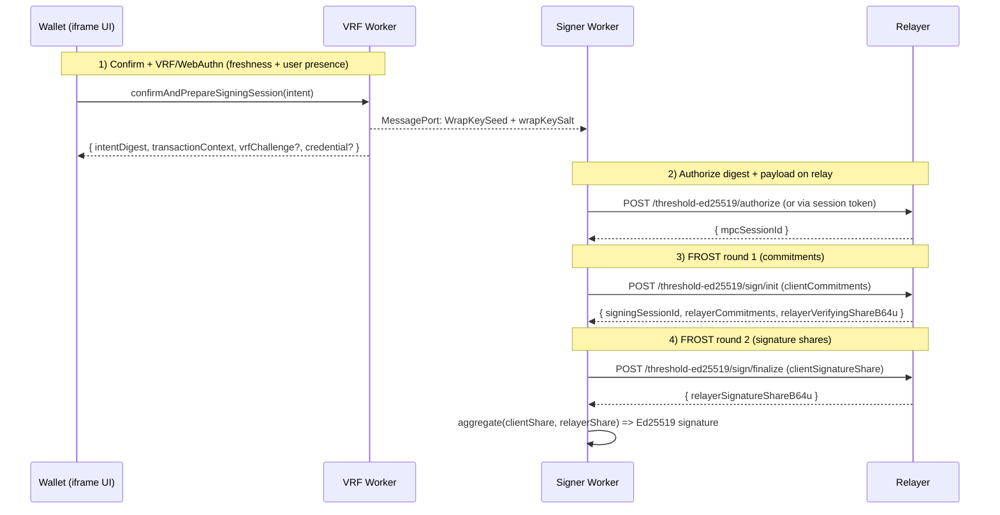

# Threshold Signing

Tatchi supports **2-of-2 threshold Ed25519 signing** (client + relayer) using a FROST-style two-round protocol. Instead of one NEAR private key living on the device or the server, the signing key is split into two shares:

- **Client share**: derived deterministically inside the signer worker from `WrapKeySeed` (from WebAuthn PRF) + `nearAccountId`.
- **Relayer share**: held by the relay (either persisted in a key store, or derived on-demand from a 32‑byte master secret).

The NEAR account adds the **threshold group public key** as an access key. From that point on, any transaction signed with this key requires *both* the client and the relayer to participate.

## Key Material

### Client share (deterministic)

The client share is derived from `WrapKeySeed` inside the signer worker and never leaves the worker boundary. The share is deterministic per `(nearAccountId, WrapKeySeed)` so the wallet can re-derive it on-demand during a signing session.

### Relayer share modes

The relay can operate in one of two modes:

- **`kv` mode**: `/threshold-ed25519/keygen` generates a random relayer signing share and persists it (Redis/Upstash/in-memory).
- **`derived` mode**: the relay derives its share on-demand from `THRESHOLD_ED25519_MASTER_SECRET_B64U` + `(nearAccountId, rpId, clientVerifyingShareB64u)` and stores nothing long-lived.
- **`auto` mode**: uses derived mode when `THRESHOLD_ED25519_MASTER_SECRET_B64U` is present; otherwise behaves like `kv`.

## Enrollment Flow

Threshold enrollment is intended to run *after* the passkey is registered on-chain. It does two things:

1. Registers the relayer as the co-signer for this account/device (`/threshold-ed25519/keygen`).
2. Activates the returned group public key on-chain via `AddKey(groupPk)` (signed locally).

At the end of enrollment the client stores a local `threshold_ed25519_2p_v1` record (group public key + `relayerKeyId` + `wrapKeySalt`).

## Signing Flow

Threshold signing is used whenever the SDK chooses `signerMode: 'threshold-signer'` and threshold key material exists for the current device/account.

At a high level:

1. The VRF/confirmation flow produces a fresh `intentDigest`, `transactionContext` (nonce/block hash), and (when needed) a WebAuthn assertion.
2. The signer worker derives the client signing share from `WrapKeySeed`, runs 2-round FROST with the relayer, and aggregates the final Ed25519 signature.

## Protocol Math

This section describes the *math* behind the 2-of-2 FROST-style Ed25519 scheme implemented in the signer worker (client) and relayer (server).

Notation:
- Scalars live in the Ed25519 scalar field `𝔽_ℓ` (mod the curve order `ℓ`).
- `G` is the Ed25519 basepoint.
- We use fixed participant identifiers `x₁ = 1` (client) and `x₂ = 2` (relayer).

### Keygen Math

The system uses a “scaffolding” keygen (not a full DKG): each party has a long-lived scalar share, and the *group secret* is the Lagrange interpolation at `x=0` of the 2-point polynomial through those shares.

1. Client derives its signing share scalar `s₁` deterministically from `WrapKeySeed` and `nearAccountId` via HKDF, then computes its verifying share `V₁ = s₁·G`.
2. Relayer chooses/derives its signing share scalar `s₂`, then computes its verifying share `V₂ = s₂·G`.

Given the signer set `{1,2}`, the Lagrange coefficients at `x=0` are:
- `λ₁ = 2`
- `λ₂ = −1`

So the (never-materialized) group secret scalar is:

`s = λ₁·s₁ + λ₂·s₂ = 2s₁ − s₂  (mod ℓ)`

And the on-chain public key is:

`Y = s·G = 2V₁ − V₂`

Code references:
- Client share derivation + verifying share: `sdk/src/wasm_signer_worker/src/threshold/threshold_client_share.rs:11` (`derive_threshold_client_share_scalar_v1`, `derive_threshold_client_verifying_share_bytes_v1`)
- Relayer derived-share HKDF construction: `sdk/src/wasm_signer_worker/src/threshold/threshold_frost.rs:37` (`derive_threshold_relayer_share_scalar_v1`)
- Relayer random-share generation: `sdk/src/wasm_signer_worker/src/threshold/threshold_frost.rs:110`
- Group public key from `{V₁,V₂}` using `λ₁=2, λ₂=-1`: `sdk/src/wasm_signer_worker/src/threshold/threshold_frost.rs:129`

### Signing Math (Two-Round FROST)

Threshold signing produces a standard 64-byte Ed25519 signature `(R, z)` that verifies with:

`z·G = R + c·Y`

where `c = H(R, Y, m)` and `m` is the 32-byte signing digest (the SDK always signs digests, not raw transactions).

**Round 1 (commitments):**

Each party samples two fresh random nonces `(dᵢ, eᵢ)` and publishes two nonce commitments:
- `Dᵢ = dᵢ·G` (hiding)
- `Eᵢ = eᵢ·G` (binding)

**Round 2 (signature shares):**

The coordinator computes binding factors `ρᵢ = H(i, m, all commitments)` and the group commitment:

`R = Σ (Dᵢ + ρᵢ·Eᵢ)`

Then each party returns a signature share:

`zᵢ = dᵢ + ρᵢ·eᵢ + λᵢ·sᵢ·c   (mod ℓ)`

Finally the coordinator aggregates:

`z = Σ zᵢ  (mod ℓ)`

and returns `(R, z)`.

Code references:
- Client round1 commit + send commitments: `sdk/src/wasm_signer_worker/src/threshold/signer_backend.rs:567`
- Relayer round1 commit helper (WASM): `sdk/src/wasm_signer_worker/src/threshold/threshold_frost.rs:235`
- Client round2 signature share + finalize: `sdk/src/wasm_signer_worker/src/threshold/signer_backend.rs:617`
- Relayer round2 signature share helper (WASM): `sdk/src/wasm_signer_worker/src/threshold/threshold_frost.rs:296`
- Aggregation into final Ed25519 signature: `sdk/src/wasm_signer_worker/src/threshold/signer_backend.rs:656`

## Threshold Sessions

To avoid running `/authorize` with WebAuthn+VRF on every signature, the SDK can mint a short-lived, limited-use threshold session:

- Client calls `POST /threshold-ed25519/session` once (usually during login), passing a **session policy** `{ ttlMs, remainingUses }` and a VRF proof that includes `session_policy_digest_32`.
- The relayer stores the session server-side and returns a JWT (or sets an HttpOnly cookie).
- Subsequent `/authorize` calls can use the session token instead of a fresh WebAuthn assertion.

The session policy is validated server-side (TTL caps + use count caps) and is *cryptographically bound* into the VRF challenge to prevent policy tampering.

## Code Pointers

- Client enrollment: `sdk/src/core/WebAuthnManager/index.ts` (`enrollThresholdEd25519KeyPostRegistration`, `enrollThresholdEd25519Key`)
- Client signing switch + payload plumbing: `sdk/src/core/WebAuthnManager/SignerWorkerManager/handlers/signTransactionsWithActions.ts`
- Signer worker threshold backend: `sdk/src/wasm_signer_worker/src/threshold/signer_backend.rs`
- Relayer HTTP endpoints (from WASM): `sdk/src/wasm_signer_worker/src/threshold/relayer_http.rs`
- Relayer service implementation: `sdk/src/server/core/ThresholdService/ThresholdEd25519Service.ts`
- Express routes: `sdk/src/server/router/express/routes/thresholdEd25519.ts`
