# Threshold Signing

Tatchi supports **2-of-2 threshold Ed25519 signing** (client + relayer) using a FROST-style two-round protocol. Instead of one NEAR private key living on the device or the server, the signing key is split into two shares:

- **Client share**: derived deterministically inside the signer worker from `WrapKeySeed` (from WebAuthn PRF) + `nearAccountId`.
- **Relayer share**: held by the relay (either persisted in a key store, or derived on-demand from a 32‑byte master secret).

The NEAR account adds the **threshold group public key** as an access key. From that point on, any transaction signed with this key requires *both* the client and the relayer to participate.

## Key Material

### Client share (deterministic)

The client share is derived from `WrapKeySeed` inside the signer worker and never leaves the worker boundary. The share is deterministic per `(nearAccountId, WrapKeySeed)` so the wallet can re-derive it on-demand during a signing session.

### Relayer share modes

The relay can operate in one of two modes:

- **`kv` mode**: `/threshold-ed25519/keygen` generates a random relayer signing share and persists it (Redis/Upstash/in-memory).
- **`derived` mode**: the relay derives its share on-demand from `THRESHOLD_ED25519_MASTER_SECRET_B64U` + `(nearAccountId, rpId, clientVerifyingShareB64u)` and stores nothing long-lived.
- **`auto` mode**: uses derived mode when `THRESHOLD_ED25519_MASTER_SECRET_B64U` is present; otherwise behaves like `kv`.

## Enrollment Flow

Threshold enrollment is intended to run *after* the passkey is registered on-chain. It does two things:

1. Registers the relayer as the co-signer for this account/device (`/threshold-ed25519/keygen`).
2. Activates the returned group public key on-chain via `AddKey(groupPk)` (signed locally).

```mermaid
sequenceDiagram
  participant App as Wallet (iframe UI)
  participant VRF as VRF Worker
  participant Signer as Signer Worker
  participant Relay as Relayer
  participant NEAR as NEAR RPC

  Note over App,Signer: 1) Derive client verifying share from WrapKeySeed
  App->>Signer: deriveThresholdEd25519ClientVerifyingShare(sessionId, nearAccountId)
  Signer-->>App: clientVerifyingShareB64u + wrapKeySalt

  Note over App,VRF: 2) Build VRF challenge bound to keygen intent
  App->>NEAR: viewBlock(final)
  NEAR-->>App: blockHeight + blockHash
  App->>VRF: generateVrfChallengeOnce(intentDigest=keygenIntent)
  VRF-->>App: vrfChallenge
  App->>App: WebAuthn get() using vrfChallenge as challenge

  Note over App,Relay: 3) Keygen on relay (WebAuthn+VRF verified)
  App->>Relay: POST /threshold-ed25519/keygen
  Relay-->>App: { publicKey=groupPk, relayerKeyId, relayerVerifyingShareB64u }

  Note over App,NEAR: 4) Activate groupPk on-chain
  App->>Signer: sign AddKey(groupPk) (no extra prompt)
  Signer-->>App: signedTx(AddKey)
  App->>NEAR: sendTransaction(AddKey)
```

At the end of enrollment the client stores a local `threshold_ed25519_2p_v1` record (group public key + `relayerKeyId` + `wrapKeySalt`).

## Signing Flow

Threshold signing is used whenever the SDK chooses `signerMode: 'threshold-signer'` and threshold key material exists for the current device/account.

At a high level:

1. The VRF/confirmation flow produces a fresh `intentDigest`, `transactionContext` (nonce/block hash), and (when needed) a WebAuthn assertion.
2. The signer worker derives the client signing share from `WrapKeySeed`, runs 2-round FROST with the relayer, and aggregates the final Ed25519 signature.

## Threshold Sessions

To avoid running `/authorize` with WebAuthn+VRF on every signature, the SDK can mint a short-lived, limited-use threshold session:

- Client calls `POST /threshold-ed25519/session` once (usually during login), passing a **session policy** `{ ttlMs, remainingUses }` and a VRF proof that includes `session_policy_digest_32`.
- The relayer stores the session server-side and returns a JWT (or sets an HttpOnly cookie).
- Subsequent `/authorize` calls can use the session token instead of a fresh WebAuthn assertion.

The session policy is validated server-side (TTL caps + use count caps) and is *cryptographically bound* into the VRF challenge to prevent policy tampering.

## Code Pointers

- Client enrollment: `sdk/src/core/WebAuthnManager/index.ts` (`enrollThresholdEd25519KeyPostRegistration`, `enrollThresholdEd25519Key`)
- Client signing switch + payload plumbing: `sdk/src/core/WebAuthnManager/SignerWorkerManager/handlers/signTransactionsWithActions.ts`
- Signer worker threshold backend: `sdk/src/wasm_signer_worker/src/threshold/signer_backend.rs`
- Relayer HTTP endpoints (from WASM): `sdk/src/wasm_signer_worker/src/threshold/relayer_http.rs`
- Relayer service implementation: `sdk/src/server/core/ThresholdService/ThresholdEd25519Service.ts`
- Express routes: `sdk/src/server/router/express/routes/thresholdEd25519.ts`
