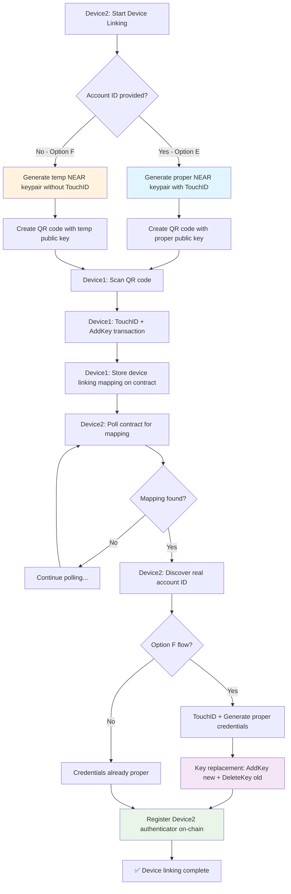

# Device Linking by QR Code

## Overview

The device linking flow enables users to add a companion device (Device2) to their existing NEAR account by scanning a QR code with their original device (Device1). This creates a **1:N mapping** where multiple devices can authenticate for the same account.

## Key Features

- ✅ **Hybrid Flow Support**: Account ID provided (fast) or discovered (seamless UX)
- ✅ **Deterministic VRF**: Proper account-specific key derivation for recovery
- ✅ **On-Chain Backup**: Device2 authenticator stored on-chain for account recovery
- ✅ **Atomic Operations**: Key replacement happens in single transaction
- ✅ **Clean Database**: Failed attempts automatically cleaned up
- ✅ **Security**: TouchID authentication with cryptographic verification

## Flow Types

### **Option E: Account ID Provided (Faster)**
User provides account ID upfront → Generate proper NEAR keypair immediately

### **Option F: Account Discovery (Seamless UX)**
No account ID needed → Generate temp keypair → Discover account → Replace with proper keypair

## Complete Flow Diagram



## Technical Implementation

### 1. Device2 QR Generation

**Option E (Account Provided):**
```typescript
// Generate proper NEAR keypair immediately
const vrfChallenge = await generateBootstrapVrfChallenge(context, accountId);
const credential = await webAuthnManager.touchIdPrompt.generateRegistrationCredentials({
  nearAccountId: accountId,
  challenge: vrfChallenge.outputAs32Bytes(),
});
const nearKeyResult = await webAuthnManager.deriveNearKeypairAndEncrypt({
  credential,
  nearAccountId: accountId
});
```

**Option F (Account Discovery):**
```typescript
// Generate temporary Ed25519 keypair without TouchID
const tempNearKeyResult = await generateTemporaryNearKeypair();
// Store temp private key for later key replacement
session.tempPrivateKey = tempNearKeyResult.privateKey;
```

### 2. Device1 Authorization

```typescript
// Single TouchID prompt for both transactions
const vrfChallenge = await webAuthnManager.generateVrfChallenge(vrfInputData);
const credential = await webAuthnManager.touchIdPrompt.getCredentials({
  nearAccountId: device1AccountId,
  challenge: vrfChallenge.outputAs32Bytes(),
  authenticators,
});

// Execute two transactions atomically
const results = await webAuthnManager.signTransactionsWithActions({
  transactions: [
    // Transaction 1: AddKey - Add Device2's key
    {
      nearAccountId: device1AccountId,
      receiverId: device1AccountId,
      actions: [{
        actionType: ActionType.AddKey,
        public_key: devicePublicKey,
        access_key: JSON.stringify({ nonce: 0, permission: { FullAccess: {} } })
      }]
    },
    // Transaction 2: Store mapping in contract
    {
      nearAccountId: device1AccountId,
      receiverId: contractId,
      actions: [{
        actionType: ActionType.FunctionCall,
        method_name: 'store_device_linking_mapping',
        args: JSON.stringify({
          device_public_key: devicePublicKey,
          target_account_id: device1AccountId,
        }),
        gas: '50000000000000', // 50 TGas
        deposit: '0'
      }]
    }
  ],
  // ... other parameters
});
```

### 3. Device2 Account Discovery

```typescript
// Poll contract for device linking mapping
const linkingResult = await nearClient.view({
  account: contractId,
  method: 'get_device_linking_account',
  args: { device_public_key: tempPublicKey }
});

if (linkingResult && Array.isArray(linkingResult) && linkingResult.length >= 2) {
  const [linkedAccountId, accessKeyPermission] = linkingResult;
  session.accountId = linkedAccountId;
  return true; // Found mapping
}
```

### 4. Key Replacement (Option F Only)

```typescript
// Generate proper credentials with TouchID
const vrfChallenge = await generateBootstrapVrfChallenge(context, realAccountId);
const credential = await webAuthnManager.touchIdPrompt.generateRegistrationCredentials({
  nearAccountId: realAccountId,
  challenge: vrfChallenge.outputAs32Bytes(),
});

// Re-derive NEAR keypair with proper account-specific salt
const nearKeyResult = await webAuthnManager.deriveNearKeypairAndEncrypt({
  credential: credential,
  nearAccountId: realAccountId
});

// Execute atomic key replacement transaction
const result = await webAuthnManager.signTransactionWithKeyPair({
  nearPrivateKey: tempPrivateKey,
  signerAccountId: realAccountId,
  receiverId: realAccountId,
  nonce: nextNonce,
  blockHashBytes: Array.from(txBlockHashBytes),
  actions: [
    {
      actionType: ActionType.AddKey,
      public_key: nearKeyResult.publicKey, // New proper key
      access_key: JSON.stringify({ nonce: 0, permission: { FullAccess: {} } })
    },
    {
      actionType: ActionType.DeleteKey,
      public_key: oldTempPublicKey // Remove temp key
    }
  ]
});
```

### 5. On-Chain Authenticator Registration

```typescript
// Register Device2's authenticator on-chain for account recovery
const actionResult = await executeAction(context, realAccountId, {
  type: ActionType.FunctionCall,
  receiverId: contractId,
  methodName: 'link_device_register_user',
  args: {
    vrf_data: {
      vrf_input_data: Array.from(base64UrlDecode(vrfChallenge.vrfInput)),
      vrf_output: Array.from(base64UrlDecode(vrfChallenge.vrfOutput)),
      vrf_proof: Array.from(base64UrlDecode(vrfChallenge.vrfProof)),
      public_key: Array.from(base64UrlDecode(vrfChallenge.vrfPublicKey)),
      user_id: realAccountId,
      rp_id: window.location.hostname,
      block_height: vrfChallenge.blockHeight,
      block_hash: Array.from(base64UrlDecode(vrfChallenge.blockHash))
    },
    webauthn_registration: {
      id: credential.id,
      raw_id: Array.from(new Uint8Array(credential.rawId)),
      type: credential.type,
      response: {
        client_data_json: credential.response.clientDataJSON,
        attestation_object: credential.response.attestationObject,
        transports: credential.response.transports || ['internal']
      }
    },
    deterministic_vrf_public_key: deterministicVrfPublicKey
  },
  gas: '50000000000000',
  deposit: '0'
});
```

## Contract Integration

### Device Linking Mapping Storage

```rust
// Store temporary mapping: Device2 public key -> Device1 account
pub fn store_device_linking_mapping(
    &mut self,
    device_public_key: String,
    target_account_id: AccountId,
) -> bool
```

### Account Discovery

```rust
// Get account ID from Device2's public key
pub fn get_device_linking_account(
    &self,
    device_public_key: String
) -> Option<(AccountId, AccessKeyPermission)>
```

### Authenticator Registration

```rust
// Add Device2's authenticator to existing account (1:N mapping)
pub fn link_device_register_user(
    &mut self,
    vrf_data: VRFVerificationData,
    webauthn_registration: WebAuthnRegistrationCredential,
    deterministic_vrf_public_key: Option<Vec<u8>>,
) -> VerifyRegistrationResponse
```

## VRF Key Derivation

### Account-Specific Salt Generation

```rust
// Generate account-specific salt for deterministic key derivation
fn near_key_salt_for_account(account_id: &str) -> String {
    format!("near-key-derivation:{}", account_id)
}
```

### Proper vs Temp Derivation

**Temp Account (Option F initial):**
```rust
// Salt: "near-key-derivation:temp-device-linking.testnet"
// Used only for QR generation, replaced later
```

**Real Account (both Options):**
```rust
// Salt: "near-key-derivation:serp117.web3-authn-v4.testnet"
// Used for actual authentication and account recovery
```

## Error Handling & Cleanup

### Failed Attempt Cleanup

```typescript
async cleanupFailedLinkingAttempt(): Promise<void> {
  // Remove any authenticator data for the real account
  await IndexedDBManager.clientDB.deleteAllAuthenticatorsForUser(accountId);

  // Remove any user data for the real account
  await IndexedDBManager.clientDB.deleteUser(accountId);

  // Remove VRF credentials for both temp and real accounts
  await IndexedDBManager.nearKeysDB.deleteEncryptedKey(accountId);
  await IndexedDBManager.nearKeysDB.deleteEncryptedKey('temp-device-linking.testnet');
}
```

### Session Management

```typescript
interface DeviceLinkingSession {
  accountId: string | null; // Null until discovered (Option F) or provided (Option E)
  nearPublicKey: string;
  credential: PublicKeyCredential | null; // Null for Option F until real account discovered
  vrfChallenge: VRFChallenge | null; // Null for Option F until real account discovered
  status: DeviceLinkingStatus;
  createdAt: number;
  expiresAt: number;
  tempPrivateKey?: string; // For Option F flow - temporary private key before replacement
}
```

### TouchID Requirements

- **Device1**: TouchID required for authorization transaction
- **Device2 Option E**: TouchID required for proper credential generation
- **Device2 Option F**: TouchID only when account is discovered (better UX)

### Key Management

- **Temporary keys**: Only used for QR generation and initial AddKey
- **Proper keys**: Account-specific derivation for authentication and recovery
- **Atomic replacement**: Old temp key deleted in same transaction as new key addition

### Account Recovery

- **Both devices** have authenticators stored on-chain in 1:N mapping
- **Deterministic derivation** ensures consistent recovery across devices
- **VRF credentials** properly scoped to real account for recovery

## Benefits

1. **Seamless UX**: No need to input account ID (Option F)
2. **Fast Alternative**: Account ID input for immediate setup (Option E)
3. **Secure**: TouchID + cryptographic verification at every step
4. **Recoverable**: Both devices backed up on-chain for account recovery
5. **Clean**: Failed attempts automatically cleaned up
6. **Atomic**: Key operations happen in single transactions
7. **Scalable**: Supports unlimited device linking per account

## Troubleshooting

### Common Issues

**QR Code Not Detected:**
- Ensure good lighting and camera focus
- Try uploading QR image instead of camera scanning

**Polling Timeout:**
- Check network connectivity
- Verify Device1 completed authorization transaction
- Increase polling timeout if needed

**Key Replacement Failed:**
- Check account has sufficient gas balance
- Verify temporary private key is valid
- Ensure new public key derivation succeeded

**Account Recovery Issues:**
- Verify authenticator was registered on-chain
- Check VRF credentials are using real account salt
- Confirm 1:N mapping exists in contract state