# WebAuthn VRF Protocol for NEAR - Implementation

## Summary

This document describes the **WebAuthn VRF Protocol for NEAR** - a serverless authentication system with encrypted keypair management and streamlined authentication flows:

1. **VRF Registration** (First-time users): One-time setup that generates and stores encrypted VRF + WebAuthn credentials
2. **VRF Login** (Session initialization): Decrypt VRF keypair into memory to generate WebAuthn challenges
3. **VRF Authentication** (Signing NEAR transactions): Stateless challenge generation and verification

This design eliminates contract dependencies while maintaining security guarantees and **reduces authentication to a single TouchID prompt**.

## **Key Innovations**

### 1. **Web Worker Architecture**
- **Client-Side Hosting**: Worker files hosted by user (via build tool integration)
- **No Scope Issues**: Web Workers avoid Service Worker scope and registration complexity
- **Immediate Initialization**: Web Workers start instantly without activation delays
- **WASM Security**: VRF operations executed in isolated WASM linear memory for enhanced security
- **Session-Based**: VRF keypair persists in worker memory during browser session

**Web Worker Benefits vs Service Workers:**
- ✅ **Simpler Setup**: No scope configuration or registration complexity
- ✅ **Immediate Start**: No waiting for Service Worker activation
- ✅ **Direct Communication**: Standard Worker messaging without MessageChannel complexity
- ✅ **Build Tool Friendly**: Standard file copying without MIME type issues
- ⚠️ **Session-only**: VRF session ends when browser/tab closes (simpler than Service Worker persistence)

### 2. **Encrypted VRF Keypair Management**
- **Registration Flow**: Generate VRF keypair → Encrypt with WebAuthn PRF → Store in IndexedDB
- **Login Flow**: Decrypt VRF keypair into Worker memory using WebAuthn PRF (Single TouchID)
- **Authentication Flow**: Worker generates challenges automatically without TouchID


### 4. **Stateless Operations**
Single contract call that verifies both VRF proof and WebAuthn response simultaneously.

### 5. **NEAR Integration**
Uses NEAR block data for freshness guarantees and replay protection.

## **VRF Challenge Construction Specification**

### **Secure Input Construction**
```rust
let domain = b"web_authn_challenge_v1";
let input_data = [
    domain,
    user_id.as_bytes(),
    rp_id.as_bytes(),
    session_id.as_bytes(),
    &block_height.to_le_bytes(),
    &block_hash,
    &timestamp.to_le_bytes(),
].concat();

let vrf_input = sha2::Sha256::digest(&input_data);
let (vrf_output, vrf_proof) = vrf_keypair.prove(&vrf_input);
// The vrf_output becomes the WebAuthn challenge
```

### **Input Components**

| Field              | Purpose                                                              | Source                    |
| ------------------ | -------------------------------------------------------------------- | ------------------------- |
| `domain_separator` | Prevents cross-protocol collisions (`"web_authn_challenge_v1"`)     | Fixed constant            |
| `user_id`          | Binds the challenge to a user identity                               | Client session/state     |
| `relying_party_id` | Binds it to a specific origin (e.g. `"example.com"`)               | Client configuration      |
| `session_id`       | Ties the challenge to the current session, optionally random        | Client-generated UUID     |
| `block_height`     | Ensures freshness and replay protection from NEAR                   | NEAR RPC call             |
| `block_hash`       | Prevents challenge reuse across forks or block reorgs               | NEAR RPC call             |
| `timestamp`        | Optional, but helps with auditability and expiry logic              | `Date.now()`              |

### **Security Properties**

1. **Domain Separation**: Prevents VRF outputs from being reused in other protocols
2. **User Binding**: Each user gets unique challenges even with same other inputs
3. **Origin Binding**: Challenges are tied to specific relying party
4. **Session Freshness**: Session ID ensures challenges are unique per session
5. **Block Freshness**: NEAR block data prevents old challenge reuse
6. **Fork Protection**: Block hash prevents challenges from being valid across chain forks
7. **Temporal Binding**: Timestamp provides auditability and expiry semantics

## **Three-Flow Implementation**

### **Flow 1: VRF Registration** (First-time users - One-time setup)

```mermaid
sequenceDiagram
    participant Client
    participant WASM as WASM Worker
    participant NEAR as NEAR RPC
    participant Contract as Web3Authn Contract

    Note over Client: 1. Get NEAR block data for freshness
    Client->>NEAR: 2. Get latest block (height + hash)
    NEAR->>Client: 3. Block height + hash
    Note over Client: 4. Generate VRF keypair and challenge (bootstrap)
    Client->>WASM: 5. generateVrfKeypair(saveInMemory=true, vrfInputs)
    WASM->>WASM: 6. Generate VRF keypair + persist in memory
    WASM->>WASM: 7. Generate VRF challenge with domain separation
    WASM->>Client: 8. VRF challenge data (keypair stored in memory)
    Note over Client: 9. WebAuthn registration ceremony with VRF challenge
    Client->>Client: 10. WebAuthn registration with PRF (TouchID)
    Note over Client: 11. Encrypt VRF keypair with PRF output
    Client->>WASM: 12. encryptVrfKeypairWithPrf(expectedPublicKey, prfOutput)
    WASM->>WASM: 13. Verify public key matches stored keypair
    WASM->>WASM: 14. Encrypt VRF keypair with AES-GCM + HKDF
    WASM->>Client: 15. Encrypted VRF keypair for storage
    Client->>Client: 16. Store encrypted VRF keypair in IndexedDB
    Client->>Contract: 17. verify_registration_response(registration, vrf_proof, vrf_pubkey, vrf_input)
    Contract->>Contract: 18. Verify VRF proof ✓
    Contract->>Contract: 19. Extract challenge from VRF output
    Contract->>Contract: 20. Verify WebAuthn registration ✓
    Contract->>Contract: 21. Store VRF pubkey + authenticator on-chain
    Contract->>Client: 22. Registration complete ✅
```



**Key UX Optimization**: This registration flow requires only **ONE TouchID prompt** during the entire registration process. The single VRF keypair is generated first, used for the WebAuthn challenge, then encrypted with the PRF output from that same ceremony.

**Single VRF Keypair Architecture**: The registration process uses a clean two-step approach:
1. **Bootstrap Generation**: `generateVrfKeypair(saveInMemory=true, vrfInputs)` - generates VRF keypair and challenge, stores keypair in memory temporarily
2. **PRF Encryption**: `encryptVrfKeypairWithPrf(expectedPublicKey, prfOutput)` - encrypts the same in-memory VRF keypair with real PRF output


### **Flow 2: VRF Login** (Session initialization - Single TouchID)

```mermaid
sequenceDiagram
    participant Client
    participant WebWorker as VRF Web Worker

    Note over Client: 🔐 Login Flow: Unlock VRF Keypair
    Note over Client: 1. User initiates login session
    Note over Client: 2. WebAuthn authentication with PRF (TouchID #1)
    Note over Client: 3. Derive AES key from PRF output
    Client->>Client: 4. Retrieve encrypted VRF keypair from IndexedDB
    Client->>WebWorker: 5. Initialize VRF Web Worker
    WebWorker->>WebWorker: 6. Load VRF WASM module
    Client->>WebWorker: 7. Send unlock request with PRF key + encrypted data
    WebWorker->>WebWorker: 8. Decrypt VRF keypair with derived AES key
    WebWorker->>WebWorker: 9. VRF keypair loaded into WASM memory
    WebWorker->>Client: 10. VRF session active confirmation
    Note over WebWorker: ✅ VRF keypair ready for challenge generation
    Note over Client: Session active - no more TouchID needed for challenges
```



### **Flow 3: VRF Authentication** (Ongoing operations - Single TouchID per auth)

```mermaid
sequenceDiagram
    participant Client
    participant WebWorker as VRF Web Worker
    participant NEAR as NEAR RPC
    participant Contract as Web3Authn Contract

    Note over Client: 🔁 Authentication Flow (e.g. signing transactions)
    Client->>NEAR: 1. Get latest block (height + hash)
    Note over Client: 2. Construct VRF input with domain separator
    Client->>WebWorker: 3. Send challenge generation request
    WebWorker->>WebWorker: 4. Generate VRF proof + output (no TouchID needed)
    WebWorker->>Client: 5. VRF challenge (bincode serialized) + proof
    Note over Client: 6. Use VRF output as WebAuthn challenge
    Note over Client: 7. WebAuthn authentication ceremony (TouchID #1)
    Client->>Contract: 8. verify_authentication_response(authentication, vrf_proof, vrf_pubkey, vrf_input)
    Contract->>Contract: 9. Verify VRF proof ✓
    Contract->>Contract: 10. Extract challenge from VRF output
    Contract->>Contract: 11. Read stored VRF pubkey + authenticator
    Contract->>Contract: 12. Verify VRF pubkey matches stored ✓
    Contract->>Contract: 13. Verify WebAuthn authentication ✓
    Contract->>Client: 14. Authentication complete ✅
```



**Key Benefits**:
- **Registration**: One-time setup with single VRF keypair generation and encryption
- **Login**: Single TouchID to unlock VRF keypair into Web Worker memory (session-based)
- **Authentication**: Single TouchID per operation (VRF challenge generated automatically)

**Security Guarantees**:
- ✅ **No challenges can be generated without initial user consent** (login required)
- ✅ **Each authentication is gated by a TouchID prompt** (WebAuthn ceremony)
- ✅ **Challenge is verifiably random and client-bound** (VRF proof)
- ✅ **VRF keypair encrypted at rest** (AES-GCM with PRF-derived key)
- ✅ **WASM memory isolation** (VRF private keys secured in WASM linear memory)

## **Implementation Architecture**

### **File Structure**
```
packages/passkey/src/
├── core/
│   ├── WebAuthnManager/
│   │   └── vrf-manager.ts              # VRF Manager (client interface)
│   ├── web3authn-vrf.worker.ts         # WASM Worker wrapper (TypeScript)
│   └── types/
│       └── vrf-worker.ts               # VRF type definitions
├── wasm_vrf_worker/
│   ├── src/
│   │   └── lib.rs                      # WASM VRF implementation (Rust)
│   └── Cargo.toml                      # Rust dependencies (vrf-wasm)
├── scripts/
│   └── copy-wasm-assets.sh             # Copies WASM files to frontend
└── dist/                               # Built artifacts
    └── web3authn-vrf.worker.js         # Compiled VRF Worker

```

### **Build System**

The VRF implementation uses a multi-stage build process:

1. **Rollup Build** (`packages/passkey/rollup.config.js`):
   ```javascript
   // VRF Service Worker build
   {
     input: 'src/core/web3authn-vrf.worker.ts',
     output: {
       file: 'dist/web3authn-vrf.worker.js',
       format: 'esm',
       sourcemap: true
     },
     plugins: [resolve(), commonjs(), typescript()]
   }
   ```

2. **Asset Copying** (`packages/passkey/scripts/copy-wasm-assets.sh`):
   ```bash
   # Copy VRF worker files
   cp src/wasm_vrf_worker/wasm_vrf_worker.js "$FRONTEND_WORKERS_DIR/"
   cp src/wasm_vrf_worker/wasm_vrf_worker_bg.wasm "$FRONTEND_WORKERS_DIR/"
   cp dist/web3authn-vrf.worker.js "$FRONTEND_WORKERS_DIR/"
   ```

3. **Development Workflow**:
   ```bash
   # Build VRF WASM module
   cd packages/passkey/src/wasm_vrf_-_worker
   wasm-pack build --target web --out-dir .

   # Build TypeScript Service Worker
   cd packages/passkey
   npm run build

   # Copy all assets to frontend
   ./scripts/copy-wasm-assets.sh
   ```

### **VRF Manager** (`packages/passkey/src/core/WebAuthnManager/vrf-manager.ts`)
Client-side interface for communicating with the VRF Service Worker:

```typescript
export class VRFManager {
  private serviceWorker: ServiceWorker | null = null;
  private initializationPromise: Promise<void> | null = null;

  // Initialize and register Service Worker
  async initialize(): Promise<void>

  // Check if Service Worker is ready
  async isReady(): Promise<boolean>

  // Unlock VRF keypair in Service Worker memory (login)
  async unlockVRFKeypair(
    nearAccountId: string,
    encryptedVrfKeypair: EncryptedVRFData,
    prfOutput: ArrayBuffer
  ): Promise<ServiceWorkerResponse>

  // Generate VRF challenge (authentication)
  async generateVRFChallenge(
    inputData: VRFInputData
  ): Promise<VRFChallengeData>

  // Get current VRF session status
  async getVRFStatus(): Promise<{
    active: boolean;
    nearAccountId?: string;
    sessionDuration?: number;
  }>

  // Clear VRF session (logout)
  async logout(): Promise<void>

  // High-level VRF operations
  async generateVrfKeypairWithPrf(
    prfOutput: ArrayBuffer
  ): Promise<{ vrfPublicKey: string; encryptedVrfKeypair: any }>

  async generateVrfChallengeWithPrf(
    prfOutput: ArrayBuffer,
    encryptedVrfKeypair: string,
    encryptedVrfNonce: string,
    userId: string,
    rpId: string,
    sessionId: string,
    blockHeight: number,
    blockHashBytes: number[],
    timestamp: number
  ): Promise<{
    vrfInput: string;
    vrfOutput: string;
    vrfProof: string;
    vrfPublicKey: string;
    rpId: string;
  }>
}
```

### **VRF Web Worker Manager** (`packages/passkey/src/core/WebAuthnManager/vrf-manager.ts`)
TypeScript manager that communicates with client-hosted VRF Web Workers:

```typescript
/**
 * VRF Manager Configuration
 */
export interface VRFManagerConfig {
  vrfWorkerUrl?: string;     // URL to VRF Web Worker (defaults to /workers/vrf-service-worker.js)
  workerTimeout?: number;    // Initialization timeout
  debug?: boolean;           // Enable debug logging
}

/**
 * Initialize Web Worker with client-hosted VRF worker
 */
private async initializeWebWorker(): Promise<void> {
  // Default URL: /workers/vrf-service-worker.js (user must host this file)
  this.vrfWorker = new Worker(this.config.vrfWorkerUrl!, { type: 'module' });

  // Set up error handling
  this.vrfWorker.onerror = (error) => {
    console.error('❌ VRF Manager: Web Worker error:', error);
  };

  // Test communication
  await this.testWebWorkerCommunication();
}

/**
 * Send message to Web Worker with direct communication (no MessageChannel needed)
 */
private async sendMessage(message: ServiceWorkerMessage): Promise<ServiceWorkerResponse> {
  return new Promise((resolve, reject) => {
    const handleMessage = (event: MessageEvent) => {
      const response = event.data as ServiceWorkerResponse;
      if (response.id === message.id) {
        this.vrfWorker!.removeEventListener('message', handleMessage);
        resolve(response);
      }
    };

    this.vrfWorker.addEventListener('message', handleMessage);
    this.vrfWorker.postMessage(message);
  });
}
```

### **WASM VRF Implementation** (`packages/passkey/src/wasm-vrf-worker/src/lib.rs`)
Rust implementation using `vrf-wasm` library with global state management:

```rust
// VRF and crypto imports
use vrf_wasm::ecvrf::ECVRFKeyPair;
use vrf_wasm::vrf::{VRFKeyPair, VRFProof};
use vrf_wasm::traits::WasmRngFromSeed;
use aes_gcm::{Aes256Gcm, Nonce, aead::{Aead, KeyInit}};
use sha2::{Digest, Sha256};
use hkdf::Hkdf;

// Global state management
thread_local! {
    static VRF_MANAGER: Rc<RefCell<VRFKeyManager>> = Rc::new(RefCell::new(VRFKeyManager::new()));
}

pub struct VRFKeyManager {
    vrf_keypair: Option<SecureVRFKeyPair>,
    session_active: bool,
    session_start_time: f64,
}

impl VRFKeyManager {
    // Generate VRF keypair for bootstrapping (stores in memory temporarily)
    pub fn generate_vrf_keypair_bootstrap(
        &mut self,
        vrf_input_params: Option<VRFInputData>,
    ) -> Result<VrfKeypairBootstrapResponse, String>

    // Encrypt VRF keypair with PRF output (looks up in-memory keypair)
    pub fn encrypt_vrf_keypair_with_prf(
        &mut self,
        expected_public_key: String,
        prf_key: Vec<u8>,
    ) -> Result<EncryptedVrfKeypairResponse, String>

    // Unlock VRF keypair using PRF-derived AES key with HKDF
    pub fn unlock_vrf_keypair(
        &mut self,
        near_account_id: String,
        encrypted_vrf_data: EncryptedVRFData,
        prf_key: Vec<u8>,
    ) -> Result<(), String>

    // Generate VRF challenge using in-memory keypair with proper domain separation
    pub fn generate_vrf_challenge(
        &self,
        input_data: VRFInputData
    ) -> Result<VRFChallengeData, String>

    // Get session status with timing
    pub fn get_vrf_status(&self) -> serde_json::Value

    // Clear session and sensitive data
    pub fn logout(&mut self) -> Result<(), String>

    // Internal methods for encryption/decryption
    fn decrypt_vrf_keypair(&self, encrypted_vrf_data: EncryptedVRFData, prf_key: Vec<u8>) -> Result<ECVRFKeyPair, String>
    fn encrypt_vrf_keypair_data(&self, vrf_keypair: &ECVRFKeyPair, prf_key: &[u8]) -> Result<(String, serde_json::Value), String>
}

// WASM exports with message routing
#[wasm_bindgen]
pub fn handle_message(message: JsValue) -> Result<JsValue, JsValue> {
    // Routes messages to appropriate VRF_MANAGER methods:
    // - PING: Health check
    // - GENERATE_VRF_KEYPAIR_BOOTSTRAP: Generate VRF keypair and store in memory
    // - ENCRYPT_VRF_KEYPAIR_WITH_PRF: Encrypt in-memory VRF keypair with PRF
    // - UNLOCK_VRF_KEYPAIR: Load keypair into memory (login)
    // - GENERATE_VRF_CHALLENGE: Create VRF challenge
    // - CHECK_VRF_STATUS: Get session status
    // - LOGOUT: Clear session
}
```

## **Security Model**

### **VRF Security Guarantees**
1. **Unpredictability**: VRF outputs are indistinguishable from random to attackers
2. **Verifiability**: Anyone can verify a VRF proof is valid for given input
3. **Uniqueness**: Same input always produces same output (deterministic)
4. **Non-malleability**: Cannot forge proofs without the private key

### **WASM Security Benefits**
1. **Memory Isolation**: VRF private keys secured in WASM linear memory
2. **Sandboxing**: WASM execution environment provides additional security layer
3. **No JavaScript Access**: VRF private keys never exposed to JavaScript context
4. **Deterministic Execution**: WASM provides predictable, auditable execution

### **Service Worker Security**
1. **Cross-Tab Persistence**: VRF session available across browser tabs
2. **Background Processing**: VRF operations continue even when tabs are closed
3. **Separate Context**: Service Worker runs in isolated context from main thread
4. **Controlled Access**: Message-based API prevents unauthorized VRF access

### **NEAR-Specific Protections**
1. **Block Height Freshness**: Challenges expire with old blocks
2. **Block Hash Binding**: Prevents reuse across forks/reorgs
3. **Account Binding**: VRF public keys tied to NEAR account IDs
4. **Contract Validation**: All VRF proofs verified on-chain

### **WebAuthn Integration**
1. **Challenge Binding**: VRF output becomes WebAuthn challenge
2. **Origin Verification**: RP ID included in VRF input construction
3. **User Presence**: WebAuthn UV/UP flags verified
4. **Signature Verification**: ECDSA/EdDSA signatures validated

## 🏗️ **Contract Interface**

### **VRF Registration**
```rust
pub fn verify_registration_response(
    &mut self,
    vrf_data: VRFVerificationData,
    webauthn_data: WebAuthnRegistrationData,
) -> VerifiedRegistrationResponse

pub struct VRFVerificationData {
    /// SHA256 hash of concatenated VRF input components
    pub vrf_input_data: Vec<u8>,
    /// Used as the WebAuthn challenge (VRF output)
    pub vrf_output: Vec<u8>,
    /// Proves vrf_output was correctly derived from vrf_input_data
    pub vrf_proof: Vec<u8>,        // bincode serialized
    /// VRF public key used to verify the proof
    pub public_key: Vec<u8>,       // bincode serialized
    /// Relying Party ID used in VRF input construction
    pub rp_id: String,
    /// Block height for freshness validation
    pub block_height: u64,
    /// Block hash included in VRF input (for entropy only)
    pub block_hash: Vec<u8>,
}
```

### **VRF Authentication**
```rust
pub fn verify_authentication_response(
    &mut self,
    vrf_data: VRFAuthenticationData,
    webauthn_data: WebAuthnAuthenticationData,
) -> VerifiedAuthenticationResponse

pub struct VRFAuthenticationData {
    /// SHA256 hash of concatenated VRF input components
    pub vrf_input_data: Vec<u8>,
    /// Used as the WebAuthn challenge (VRF output)
    pub vrf_output: Vec<u8>,
    /// Proves vrf_output was correctly derived from vrf_input_data
    pub vrf_proof: Vec<u8>,        // bincode serialized
    /// VRF public key used to verify the proof
    pub public_key: Vec<u8>,       // bincode serialized
    /// User ID (accountID) used in VRF input construction
    pub user_id: String,
    /// Relying Party ID used in VRF input construction
    pub rp_id: String,
    /// Block height for freshness validation
    pub block_height: u64,
    /// Block hash included in VRF input (for entropy only)
    pub block_hash: Vec<u8>,
}
```


## **WASM Worker SDK Integration Guide**

VRF functionality requires hosting the Web Worker files:

#### **Option 1: Manual File Copying** (Development)
```bash
# Copy VRF Web Worker files to your public directory
cp node_modules/@web3authn/passkey/dist/vrf-service-worker.js public/workers/
cp node_modules/@web3authn/passkey/dist/vrf_service_worker.js public/workers/
cp node_modules/@web3authn/passkey/dist/vrf_service_worker_bg.wasm public/workers/
```

#### **Option 2: Build Tool Integration** (Production)
```bash
# Use the provided copy script
./node_modules/@web3authn/passkey/scripts/copy-wasm-assets.sh

# Or integrate into your build process
npm run build && cp node_modules/@web3authn/passkey/dist/vrf-* public/workers/
```

#### **Option 3: Custom Build Integration**
```javascript
// vite.config.js / next.config.js / webpack.config.js
// Copy worker files as part of your build process
import { copyFile } from 'fs/promises';

const copyWorkers = async () => {
  await copyFile('node_modules/@web3authn/passkey/dist/vrf-service-worker.js', 'public/workers/vrf-service-worker.js');
  // Copy other worker files...
};
```

### **Quick Start**

1. **Initialize VRF Service Worker** (during app startup):
   ```typescript
   import { PasskeyManager } from '@web3authn/passkey';

   const passkeyManager = new PasskeyManager(config, nearRpcProvider);
   await passkeyManager.initializeVRFServiceWorker();
   ```

2. **VRF Registration** (first-time user):
   ```typescript
   const result = await passkeyManager.registerPasskey('alice.testnet', {
     optimisticAuth: true,
     onEvent: (event) => console.log('Registration event:', event)
   });

   if (result.success && result.vrfRegistration?.success) {
     console.log('✅ VRF registration complete');
     console.log('VRF Public Key:', result.vrfRegistration.vrfPublicKey);
   }
   ```

3. **VRF Login** (session initialization):
   ```typescript
   const loginResult = await passkeyManager.loginPasskey('alice.testnet');

   if (loginResult.success) {
     console.log('✅ VRF session active');
     // VRF keypair now unlocked in Service Worker memory
   }
   ```

4. **VRF Authentication** (ongoing operations):
   ```typescript
   const authResult = await passkeyManager.authenticateWithVRF(
     'alice.testnet',
     crypto.randomUUID(), // sessionId
     { verifyWithContract: true }
   );

   if (authResult.success && authResult.contractVerification?.verified) {
     console.log('✅ VRF authentication verified on-chain');
   }
   ```


### **Contract Method Details**

The contract integration calls the `verify_authentication_response` method with properly formatted data:

```rust
// Contract method signature
pub fn verify_authentication_response(
    &mut self,
    vrf_data: VRFAuthenticationData,
    webauthn_data: WebAuthnAuthenticationData,
) -> VerifiedAuthenticationResponse
```

**VRF Data Format:**
- `vrf_input_data`: SHA256 hash of VRF input components (Vec<u8>)
- `vrf_output`: VRF output used as WebAuthn challenge (Vec<u8>)
- `vrf_proof`: Bincode-serialized VRF proof (Vec<u8>)
- `public_key`: Bincode-serialized VRF public key (Vec<u8>)
- `user_id`: Account ID (String)
- `rp_id`: Relying Party ID (String)
- `block_height`: NEAR block height for freshness (u64)
- `block_hash`: NEAR block hash for entropy (Vec<u8>)

**WebAuthn Data Format:**
- `id`: Credential ID (String)
- `raw_id`: Raw credential ID (Vec<u8>)
- `response`: WebAuthn assertion response
- Standard WebAuthn fields for contract verification
