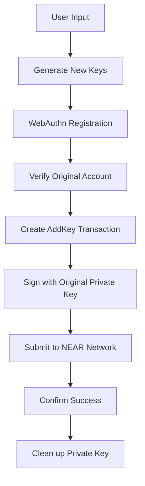

# Account Import with Private Key

## Overview

Import existing NEAR accounts with private keys to passkey authentication. The process:

1. User provides account ID and private key
2. System validates account ownership
3. Generates new passkey-protected keypair
4. Creates AddKey transaction with original private key
5. Securely disposes of original private key

## Implementation Flow

1. **Input**: User provides account ID and private key
2. **Validation**: Verify account ownership and eligibility
3. **WebAuthn**: Generate new passkey-protected keypair
4. **Transaction**: Create and submit AddKey transaction
5. **Cleanup**: Securely dispose of original private key

## Security Model

The import process uses a **key rotation strategy** that:

- **Never exposes** the original private key to the client application
- **Creates new keys** protected by WebAuthn/passkey authentication
- **Adds the new keys** as signers to the existing account
- **Maintains full access** to all existing funds and contract permissions
- **Allows discarding** the original private key after successful import

## User Experience Flow

### Step 1: Account Information Input
```
┌─────────────────────────────────────────────────┐
│ 🔐 Import NEAR Account                          │
│                                                 │
│ Account ID:                                     │
│ └─────────────────────────────────────────────┘ │
│                                                 │
│ Private Key:                                    │
│ └─────────────────────────────────────────────┘ │
│                                                 │
│ [Import Account]                                │
└─────────────────────────────────────────────────┘
```

**User Actions:**
- Paste their NEAR account ID (e.g., `alice.near`)
- Paste their 64-character hex private key
- Click "Import Account"

### Step 2: Device Setup (WebAuthn Registration)
```
┌─────────────────────────────────────────────────┐
│ 🔐 Setting up Passkey Protection               │
│                                                 │
│ Creating secure passkey for: alice.near        │
│                                                 │
│ [TouchID Prompt]                               │
│                                                 │
│ ⏳ Creating new account keys...                 │
└─────────────────────────────────────────────────┘
```

**Technical Actions:**
- Generate new Ed25519 keypair for the account
- Create WebAuthn credential with TouchID/biometric
- Encrypt the new private key with PRF output
- Store encrypted keypair in IndexedDB

### Step 3: Account Verification
```
┌─────────────────────────────────────────────────┐
│ 🔐 Verifying Account Ownership                 │
│                                                 │
│ Checking account: alice.near                   │
│                                                 │
│ ✅ Account exists                               │
│ ✅ Private key valid                           │
│ ✅ Sufficient balance for transaction          │
│                                                 │
│ ⏳ Preparing import transaction...             │
└─────────────────────────────────────────────────┘
```

**Technical Actions:**
- Verify the account exists on-chain
- Test private key validity (without storing it)
- Check account balance for transaction fees
- Prepare AddKey transaction

### Step 4: Import Transaction
```
┌─────────────────────────────────────────────────┐
│ 🔐 Importing Account                           │
│                                                 │
│ Adding new passkey keys to: alice.near         │
│                                                 │
│ Transaction Details:                           │
│ • Add passkey-protected key as signer          │
│ • Full access permissions                      │
│                                                 │
│ [Confirm with TouchID]                         │
└─────────────────────────────────────────────────┘
```

**Technical Actions:**
- Sign AddKey transaction with original private key
- Add new passkey-protected public key to account
- Submit transaction to NEAR network
- Wait for confirmation

### Step 5: Import Complete
```
┌─────────────────────────────────────────────────┐
│ ✅ Import Successful!                          │
│                                                 │
│ 🎉 Your account alice.near is now protected    │
│    by passkey authentication!                   │
│                                                 │
│ Next time you login, use:                      │
│ [Login with Passkey]                           │
│                                                 │
│ You can now safely discard your private key.   │
└─────────────────────────────────────────────────┘
```

## Technical Implementation

### Architecture Overview



### Key Components

#### 1. Account Verification Service
```typescript
interface AccountVerificationResult {
  exists: boolean;
  balance: string;
  requiredBalance: string;
  canImport: boolean;
  error?: string;
}

class AccountVerifier {
  async verifyImportEligibility(
    accountId: string,
    privateKey: string
  ): Promise<AccountVerificationResult> {
    // Verify account exists
    // Check balance for transaction fees
    // Validate private key ownership
    // Return eligibility status
  }
}
```

#### 2. Key Import Manager
```typescript
interface ImportResult {
  success: boolean;
  newPublicKey: string;
  transactionId: string;
  error?: string;
}

class KeyImportManager {
  async importAccountWithKey(
    accountId: string,
    privateKey: string,
    options: ImportOptions
  ): Promise<ImportResult> {
    // Generate new passkey-protected keys
    // Create AddKey transaction
    // Sign and submit transaction
    // Return result
  }
}
```

#### 3. Secure Key Disposal
```typescript
class SecureKeyDisposal {
  async disposePrivateKey(privateKey: string): Promise<void> {
    // Overwrite memory with random data
    // Clear from any temporary storage
    // Ensure no traces remain
  }
}
```

## Implementation Details

### Core Architecture

The import functionality will be implemented across these key modules:

#### 1. **PasskeyManager Extension** (`packages/passkey/src/core/PasskeyManager/index.ts`)

```typescript
export class PasskeyManager {
  // Existing methods...

  /**
   * Import an existing NEAR account with private key to passkey protection
   */
  async importAccountWithPrivateKey(
    accountId: string,
    privateKeyHex: string,
    options?: ImportOptions
  ): Promise<ImportResult> {
    // Main entry point - coordinates the entire import flow
  }

  /**
   * Verify account ownership and import eligibility
   */
  private async verifyAccountOwnership(
    accountId: string,
    privateKeyHex: string
  ): Promise<AccountVerification> {
    // Verify account exists and private key is valid
  }

  /**
   * Create new passkey-protected keypair for the account
   */
  private async createPasskeyCredentials(
    accountId: string
  ): Promise<WebAuthnCredential> {
    // Generate WebAuthn credential and NEAR keypair
  }

  /**
   * Execute AddKey transaction with original private key
   */
  private async executeAddKeyTransaction(
    accountId: string,
    privateKeyHex: string,
    newPublicKey: string
  ): Promise<TransactionResult> {
    // Create and submit AddKey transaction
  }
}
```

#### 2. **Account Verification Service** (`packages/passkey/src/core/PasskeyManager/account-verifier.ts`)

```typescript
// New file for account verification logic
export class AccountVerifier {
  constructor(private nearClient: NearClient) {}

  async verifyImportEligibility(
    accountId: string,
    privateKeyHex: string
  ): Promise<AccountVerificationResult> {
    // 1. Validate account ID format
    if (!isValidNearAccount(accountId)) {
      return { canImport: false, error: 'Invalid account ID format' };
    }

    // 2. Check if account exists on-chain
    try {
      const account = await this.nearClient.getAccount(accountId);
    } catch (error) {
      return { canImport: false, error: 'Account does not exist' };
    }

    // 3. Verify private key ownership (without storing)
    const tempKeypair = Keypair.fromSecretKey(privateKeyHex);
    const testMessage = 'verification-' + Date.now();
    const signature = tempKeypair.sign(testMessage);

    // 4. Check account balance for transaction fees
    const balance = await this.nearClient.getAccountBalance(accountId);
    const minBalance = '100000000000000000000000'; // 0.1 NEAR

    if (balance < minBalance) {
      return {
        canImport: false,
        error: 'Insufficient balance for transaction fees'
      };
    }

    return {
      canImport: true,
      balance,
      requiredBalance: minBalance
    };
  }
}
```

#### 3. **Secure Key Handling** (`packages/passkey/src/utils/secure-key-manager.ts`)

```typescript
// New file for secure key operations
export class SecureKeyManager {
  /**
   * Generate a temporary in-memory keypair for verification
   */
  static createTempKeypair(privateKeyHex: string): Keypair {
    const keypair = Keypair.fromSecretKey(privateKeyHex);
    // Keypair exists only in memory, never persisted
    return keypair;
  }

  /**
   * Securely dispose of private key from memory
   */
  static async disposePrivateKey(privateKeyHex: string): Promise<void> {
    // Overwrite memory with random data
    const randomBytes = crypto.getRandomValues(new Uint8Array(privateKeyHex.length));
    privateKeyHex = randomBytes.reduce((acc, byte) => acc + String.fromCharCode(byte), '');

    // Clear any references
    if (global.gc) {
      global.gc(); // Force garbage collection if available
    }
  }

  /**
   * Validate private key format without storing
   */
  static validatePrivateKeyFormat(privateKeyHex: string): boolean {
    try {
      Keypair.fromSecretKey(privateKeyHex);
      return true;
    } catch {
      return false;
    }
  }
}
```

#### 4. **Transaction Builder** (`packages/passkey/src/core/PasskeyManager/transaction-builder.ts`)

```typescript
// Extend existing transaction builder
export class TransactionBuilder {
  static createAddKeyTransaction(
    accountId: string,
    newPublicKey: string,
    signerPrivateKey: string
  ): SignedTransaction {
    // Create AddKey action
    const addKeyAction: AddKeyAction = {
      type: ActionType.AddKey,
      public_key: newPublicKey,
      access_key: {
        nonce: 0,
        permission: { FullAccess: {} }
      }
    };

    // Get current nonce
    const nonce = await this.getCurrentNonce(accountId);

    // Build transaction
    const transaction = {
      signerId: accountId,
      receiverId: accountId,
      nonce: nonce + 1,
      actions: [addKeyAction]
    };

    // Sign with original private key
    const signedTx = this.signTransaction(transaction, signerPrivateKey);

    return signedTx;
  }
}
```

## Implementation Steps

1. **Validate Account**: Verify ownership and eligibility
2. **Generate Keys**: Create new passkey-protected keypair
3. **Encrypt & Store**: Encrypt keys with PRF and store securely
4. **Create Transaction**: Build AddKey transaction with original private key
5. **Submit & Confirm**: Execute transaction and verify success
6. **Cleanup**: Securely dispose of original private key

## Key Integration Points

- **PasskeyManager**: Add `importAccountWithPrivateKey()` method
- **WebAuthnManager**: Use existing credential creation and encryption
- **NearClient**: Leverage existing transaction submission
- **IndexedDBManager**: Use existing encrypted key storage


## Secure UI Implementation

**Approach**: Use sandboxed iframe to isolate private key input from main application.

**Key Components**:
1. **ImportPrivateKeyIframe**: Lit component for secure private key input
2. **Iframe Bootstrap Script**: Secure cross-origin communication
3. **Parent Modal Host**: Manages iframe lifecycle and validation

**Security Features**:
- Private key never touches parent DOM
- Iframe has restricted permissions (`sandbox`, `credentialless`)
- Automatic cleanup on iframe destruction


