# WebAuthn VRF Protocol for NEAR - Implementation

## Summary

This document describes the **WebAuthn VRF Protocol for NEAR** — a client‑side authentication design with encrypted keypair management and streamlined flows, matching the current SDK implementation (VRF in WASM, ChaCha20‑Poly1305 encryption, HKDF domain separation):

1. **VRF Registration** (First-time users): One-time setup that generates and stores encrypted VRF + WebAuthn credentials
2. **VRF Login** (Session initialization): Decrypt VRF keypair into memory to generate WebAuthn challenges
3. **VRF Authentication** (Signing NEAR transactions): Stateless challenge generation and verification

This design eliminates contract dependencies while maintaining security guarantees and **reduces authentication to a single TouchID prompt**.

## **Key Innovations**

### 1. **Web Worker Architecture**
- **Client-Side Hosting**: Worker files hosted by user (via build tool integration)
- **No Scope Issues**: Web Workers avoid Service Worker scope and registration complexity
- **Immediate Initialization**: Web Workers start instantly without activation delays
- **WASM Security**: VRF operations executed in isolated WASM linear memory for enhanced security
- **Session-Based**: VRF keypair persists in worker memory during browser session

**Web Worker Benefits vs Service Workers:**
- **Simpler Setup**: No scope configuration or registration complexity
- **Immediate Start**: No waiting for Service Worker activation
- **Direct Communication**: Standard Worker messaging without MessageChannel complexity
- **Build Tool Friendly**: Standard file copying without MIME type issues
- ️ **Session-only**: VRF session ends when browser/tab closes (simpler than Service Worker persistence)

### 2. **Encrypted VRF Keypair Management**
- **Registration Flow**: Generate VRF keypair → Encrypt with key derived via HKDF from WebAuthn PRF output → Store in IndexedDB
- **Login Flow**: Decrypt VRF keypair into Worker memory using the same PRF‑derived key (single user gesture)
- **Authentication Flow**: Worker generates challenges automatically without TouchID


### 4. **Stateless Operations**
Single contract call that verifies both VRF proof and WebAuthn response simultaneously.

### 5. **NEAR Integration**
Uses NEAR block data for freshness guarantees and replay protection.

## **VRF Challenge Construction Specification**

### **Secure Input Construction**
```rust
let domain = b"web3_authn_vrf_challenge_v1"; // matches sdk/src/wasm_vrf_worker/src/config.rs
let input_data = [
    domain,
    user_id.as_bytes(),
    rp_id.as_bytes(),
    session_id.as_bytes(),
    &block_height.to_le_bytes(),
    &block_hash,
    &timestamp.to_le_bytes(),
].concat();

let vrf_input = sha2::Sha256::digest(&input_data);
let (vrf_output, vrf_proof) = vrf_keypair.prove(&vrf_input);
// The vrf_output becomes the WebAuthn challenge
```

### **Input Components**

| Field              | Purpose                                                              | Source                    |
| ------------------ | -------------------------------------------------------------------- | ------------------------- |
| `domain_separator` | Prevents cross-protocol collisions (`"web_authn_challenge_v1"`)     | Fixed constant            |
| `user_id`          | Binds the challenge to a user identity                               | Client session/state     |
| `relying_party_id` | Binds it to a specific origin (e.g. `"example.com"`)               | Client configuration      |
| `session_id`       | Ties the challenge to the current session, optionally random        | Client-generated UUID     |
| `block_height`     | Ensures freshness and replay protection from NEAR                   | NEAR RPC call             |
| `block_hash`       | Prevents challenge reuse across forks or block reorgs               | NEAR RPC call             |
| `timestamp`        | Optional, but helps with auditability and expiry logic              | `Date.now()`              |

### **Security Properties**

1. **Domain Separation**: Prevents VRF outputs from being reused in other protocols
2. **User Binding**: Each user gets unique challenges even with same other inputs
3. **Origin Binding**: Challenges are tied to specific relying party
4. **Session Freshness**: Session ID ensures challenges are unique per session
5. **Block Freshness**: NEAR block data prevents old challenge reuse
6. **Fork Protection**: Block hash prevents challenges from being valid across chain forks
7. **Temporal Binding**: Timestamp provides auditability and expiry semantics

## **Three-Flow Implementation**

### **Flow 1: VRF Registration** (First-time users - One-time setup)

```mermaid
sequenceDiagram
    participant Client
    participant WASM as WASM Worker
    participant NEAR as NEAR RPC
    participant Contract as Web3Authn Contract

    Note over Client: 1. Get NEAR block data for freshness
    Client->>NEAR: 2. Get latest block (height + hash)
    NEAR->>Client: 3. Block height + hash
    Note over Client: 4. Generate VRF keypair and challenge (bootstrap)
    Client->>WASM: 5. generateVrfKeypair(saveInMemory=true, vrfInputs)
    WASM->>WASM: 6. Generate VRF keypair + persist in memory
    WASM->>WASM: 7. Generate VRF challenge with domain separation
    WASM->>Client: 8. VRF challenge data (keypair stored in memory)
    Note over Client: 9. WebAuthn registration ceremony with VRF challenge
    Client->>Client: 10. WebAuthn registration with PRF (TouchID)
    Note over Client: 11. Encrypt VRF keypair with PRF output
    Client->>WASM: 12. encryptVrfKeypairWithPrf(expectedPublicKey, prfOutput)
    WASM->>WASM: 13. Verify public key matches stored keypair
    WASM->>WASM: 14. Encrypt VRF keypair with AES-GCM + HKDF
    WASM->>Client: 15. Encrypted VRF keypair for storage
    Client->>Client: 16. Store encrypted VRF keypair in IndexedDB
    Client->>Contract: 17. verify_registration_response(registration, vrf_proof, vrf_pubkey, vrf_input)
    Contract->>Contract: 18. Verify VRF proof ✓
    Contract->>Contract: 19. Extract challenge from VRF output
    Contract->>Contract: 20. Verify WebAuthn registration ✓
    Contract->>Contract: 21. Store VRF pubkey + authenticator on-chain
    Contract->>Client: 22. Registration complete ✅
```



**Key UX Optimization**: This registration flow requires only **ONE TouchID prompt** during the entire registration process. The single VRF keypair is generated first, used for the WebAuthn challenge, then encrypted with the PRF output from that same ceremony.

**Single VRF Keypair Architecture**: The registration process uses a clean two-step approach:
1. **Bootstrap Generation**: `generateVrfKeypair(saveInMemory=true, vrfInputs)` - generates VRF keypair and challenge, stores keypair in memory temporarily
2. **PRF Encryption**: `encryptVrfKeypairWithPrf(expectedPublicKey, prfOutput)` - encrypts the same in-memory VRF keypair with real PRF output


### **Flow 2: VRF Login** (Session initialization - Single TouchID)

```mermaid
sequenceDiagram
    participant Client
    participant WebWorker as VRF Web Worker

    Note over Client: 🔐 Login Flow: Unlock VRF Keypair
    Note over Client: 1. User initiates login session
    Note over Client: 2. WebAuthn authentication with PRF (TouchID #1)
    Note over Client: 3. Derive AES key from PRF output
    Client->>Client: 4. Retrieve encrypted VRF keypair from IndexedDB
    Client->>WebWorker: 5. Initialize VRF Web Worker
    WebWorker->>WebWorker: 6. Load VRF WASM module
    Client->>WebWorker: 7. Send unlock request with PRF key + encrypted data
    WebWorker->>WebWorker: 8. Decrypt VRF keypair with derived AES key
    WebWorker->>WebWorker: 9. VRF keypair loaded into WASM memory
    WebWorker->>Client: 10. VRF session active confirmation
    Note over WebWorker: ✅ VRF keypair ready for challenge generation
    Note over Client: Session active - no more TouchID needed for challenges
```



### **Flow 3: VRF Authentication** (Ongoing operations - Single TouchID per auth)

```mermaid
sequenceDiagram
    participant Client
    participant WebWorker as VRF Web Worker
    participant NEAR as NEAR RPC
    participant Contract as Web3Authn Contract

    Note over Client: 🔁 Authentication Flow (e.g. signing transactions)
    Client->>NEAR: 1. Get latest block (height + hash)
    Note over Client: 2. Construct VRF input with domain separator
    Client->>WebWorker: 3. Send challenge generation request
    WebWorker->>WebWorker: 4. Generate VRF proof + output (no TouchID needed)
    WebWorker->>Client: 5. VRF challenge (bincode serialized) + proof
    Note over Client: 6. Use VRF output as WebAuthn challenge
    Note over Client: 7. WebAuthn authentication ceremony (TouchID #1)
    Client->>Contract: 8. verify_authentication_response(authentication, vrf_proof, vrf_pubkey, vrf_input)
    Contract->>Contract: 9. Verify VRF proof ✓
    Contract->>Contract: 10. Extract challenge from VRF output
    Contract->>Contract: 11. Read stored VRF pubkey + authenticator
    Contract->>Contract: 12. Verify VRF pubkey matches stored ✓
    Contract->>Contract: 13. Verify WebAuthn authentication ✓
    Contract->>Client: 14. Authentication complete ✅
```



**Key Benefits**:
- **Registration**: One-time setup with single VRF keypair generation and encryption
- **Login**: Single TouchID to unlock VRF keypair into Web Worker memory (session-based)
- **Authentication**: Single TouchID per operation (VRF challenge generated automatically)

**Security Guarantees**:
- **No challenges can be generated without initial user consent** (login required)
- **Each authentication is gated by a TouchID prompt** (WebAuthn ceremony)
- **Challenge is verifiably random and client-bound** (VRF proof)
- **VRF keypair encrypted at rest** (ChaCha20‑Poly1305 with PRF‑derived key)
- **WASM memory isolation** (VRF private keys secured in WASM linear memory)

## **Implementation Architecture**

### **File Structure**
```
packages/passkey/src/
├── core/
│   ├── WebAuthnManager/
│   │   └── vrf-manager.ts              # VRF Manager (client interface)
│   ├── web3authn-vrf.worker.ts         # WASM Worker wrapper (TypeScript)
│   └── types/
│       └── vrf-worker.ts               # VRF type definitions
├── wasm_vrf_worker/
│   ├── src/
│   │   └── lib.rs                      # WASM VRF implementation (Rust)
│   └── Cargo.toml                      # Rust dependencies (vrf-wasm)
├── vite/
│   └── dev-plugin                      # Serves SDK assets at /sdk/* during dev (no copy)
└── dist/                               # Built artifacts
    └── web3authn-vrf.worker.js         # Compiled VRF Worker

```

### **Build System (current)**

The VRF implementation uses a multi-stage build process:

1. Rust WASM modules under `sdk/src/wasm_vrf_worker` (built via `wasm-pack`), pulled into JS via module workers.
2. Dev serving via `tatchiDev` Vite plugin: maps SDK assets to `/sdk/*` and serves `/wallet-service` without copying files.
3. CI builds both workers and JS bundles; the wallet origin serves `/sdk/workers/*` and `/sdk/wallet-iframe-host.js`.


## **Security Model**

### **VRF Security Guarantees**
1. **Unpredictability**: VRF outputs are indistinguishable from random to attackers
2. **Verifiability**: Anyone can verify a VRF proof is valid for given input
3. **Uniqueness**: Same input always produces same output (deterministic)
4. **Non-malleability**: Cannot forge proofs without the private key

### **WASM Security Benefits**
1. **Memory Isolation**: VRF private keys secured in WASM linear memory
2. **Sandboxing**: WASM execution environment provides additional security layer
3. **No JavaScript Access**: VRF private keys never exposed to JavaScript context
4. **Deterministic Execution**: WASM provides predictable, auditable execution

### **NEAR-Specific Protections**
1. **Block Height Freshness**: Challenges expire with old blocks
2. **Block Hash Binding**: Prevents reuse across forks/reorgs
3. **Account Binding**: VRF public keys tied to NEAR account IDs
4. **Contract Validation**: All VRF proofs verified on-chain

### **WebAuthn Integration**
1. **Challenge Binding**: VRF output becomes WebAuthn challenge
2. **Origin Verification**: RP ID included in VRF input construction
3. **User Presence**: WebAuthn UV/UP flags verified
4. **Signature Verification**: ECDSA/EdDSA signatures validated

## **Contract Interface**

### **VRF Registration**
```rust
pub fn verify_registration_response(
    &mut self,
    vrf_data: VRFVerificationData,
    webauthn_data: WebAuthnRegistrationData,
) -> VerifiedRegistrationResponse

pub struct VRFVerificationData {
    /// SHA256 hash of concatenated VRF input components
    pub vrf_input_data: Vec<u8>,
    /// Used as the WebAuthn challenge (VRF output)
    pub vrf_output: Vec<u8>,
    /// Proves vrf_output was correctly derived from vrf_input_data
    pub vrf_proof: Vec<u8>,        // bincode serialized
    /// VRF public key used to verify the proof
    pub public_key: Vec<u8>,       // bincode serialized
    /// Relying Party ID used in VRF input construction
    pub rp_id: String,
    /// Block height for freshness validation
    pub block_height: u64,
    /// Block hash included in VRF input (for entropy only)
    pub block_hash: Vec<u8>,
}
```

### **VRF Authentication**
```rust
pub fn verify_authentication_response(
    &mut self,
    vrf_data: VRFAuthenticationData,
    webauthn_data: WebAuthnAuthenticationData,
) -> VerifiedAuthenticationResponse

pub struct VRFAuthenticationData {
    /// SHA256 hash of concatenated VRF input components
    pub vrf_input_data: Vec<u8>,
    /// Used as the WebAuthn challenge (VRF output)
    pub vrf_output: Vec<u8>,
    /// Proves vrf_output was correctly derived from vrf_input_data
    pub vrf_proof: Vec<u8>,        // bincode serialized
    /// VRF public key used to verify the proof
    pub public_key: Vec<u8>,       // bincode serialized
    /// User ID (accountID) used in VRF input construction
    pub user_id: String,
    /// Relying Party ID used in VRF input construction
    pub rp_id: String,
    /// Block height for freshness validation
    pub block_height: u64,
    /// Block hash included in VRF input (for entropy only)
    pub block_hash: Vec<u8>,
}
```
